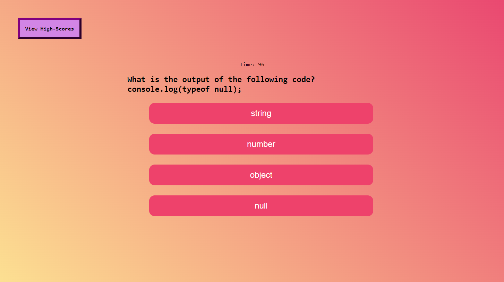
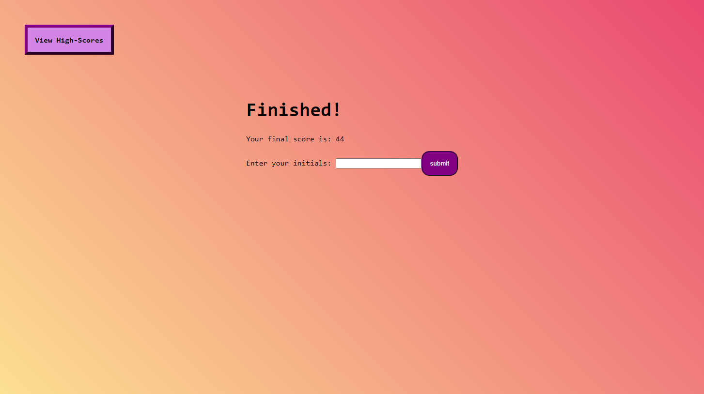

# JavaScript Code Quiz
Module 4 Challenge

This applicaton is a timed quiz on JavaScript fundamental concepts that allows users to test their knowledge and compare their scores with peers. The quiz presents a series of questions, and the user's score is determined by the number of correct answers and the time taken to complete the quiz.

## Deployed Application
You can view the live application
[here ➡️](https://cyphernyx.github.io/javascript-code-quiz/)





## Features

1. Start Button: Clicking the **"Begin Quiz!"** button initiates the quiz and starts the timer.
2. **Timer:** A countdown timer is displayed to show the remaining time.
3. **Questions:** The user is presented with a series of questions to answer.
4. **Answer Evaluation:** The user's answers are evaluated, and the next question is presented accordingly.
5. Incorrect Answer **Penalty**: If the user answers a question incorrectly, *10 second are deducted from the timer*.
6. **Game Over:** The game ends when all questions are answered or the timer reaches 0.
7. High Score **Submission**: After the game ends, the user can save their initials and score for future reference.

## Installation

Clone the repository:

```sh
git clone git@github.com:CypherNyx/javascript-code-quiz.git
```

## Usage

- This project can be used to assess and improve your understanding of JavaScript fundamentals.
- It can be used as a practice tool to prepare for coding interviews or exams.
- Users can challenge their peers to take the quiz and compare their scores.

## Technologies Used


 
